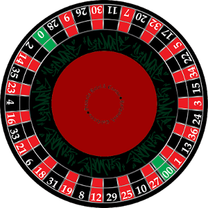
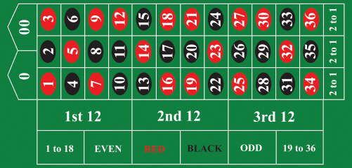

rouletteModelApp
================

I have been working a lot with AngularJS lately and I had a few incarnations of this idea.  The early attempts were more jQuery then AngularJS but I think I'm getting into the Angular mindset finally.

If you have ever looked closely at the American roulette wheel you might have noticed that the numbers on the table are not in the same order as they are ordered on the wheel. See the images below.

This makes it difficult if you have a favorite number and would also like to bet on that number's neighbors.  So that's what this app is meant to help with.  If you click on a number the two nearest numbers on either side will be highlighted.  The number clicked will be in a darker blue, the closest neighbors in a slightly lighter blue, and the farther neighbors in an even lighter blue.

A demo of the app is available on my blog.  [AngularJS Roulette](http://grafcode.net/blog/?p=131)
